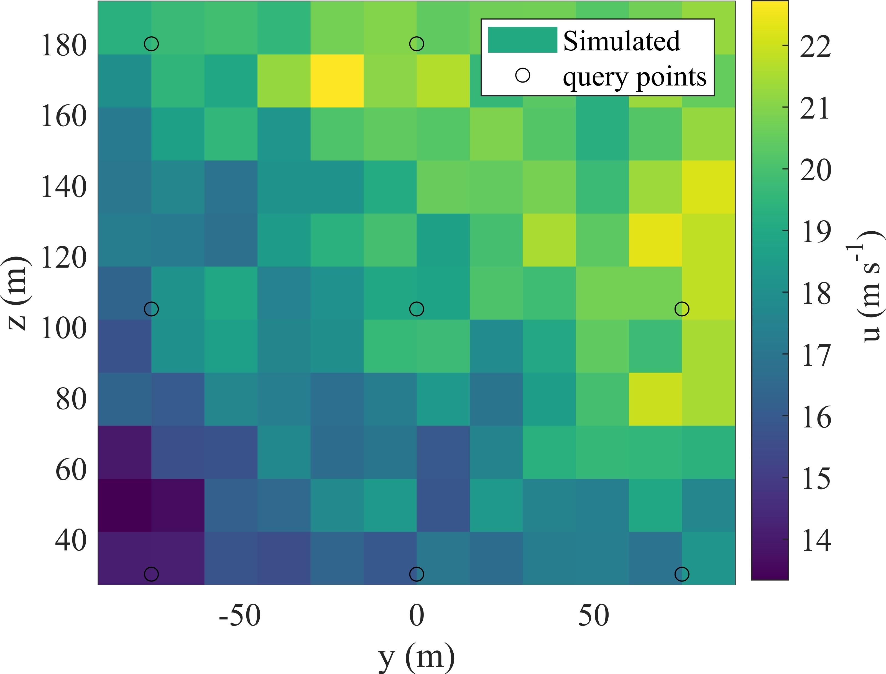

# Constrained wind simulation in a 2D plane

## Summary
 
Matlab code for a conditional/constrained wind simulation in a 2D plane. The coherence function is modelled using the Davenport model. Only one velocity component is simulated at a time. It is possible to generate non-stationary event with time-varying coherence, but the simulation time will be significantly increased.
 
 
 
 
 
## Contents

The repository contains

  - coherence.m: Calculates the coherence for two signals.
  - condWindSim2D.m: Generates a 2D conditional/constrained wind field.
  - The Matlab Live Script Documentation.mlx, which documents how to use the function.

## This is the first version of the repository, there may be many bugs. Do not hesitate to contact me if you find any.
